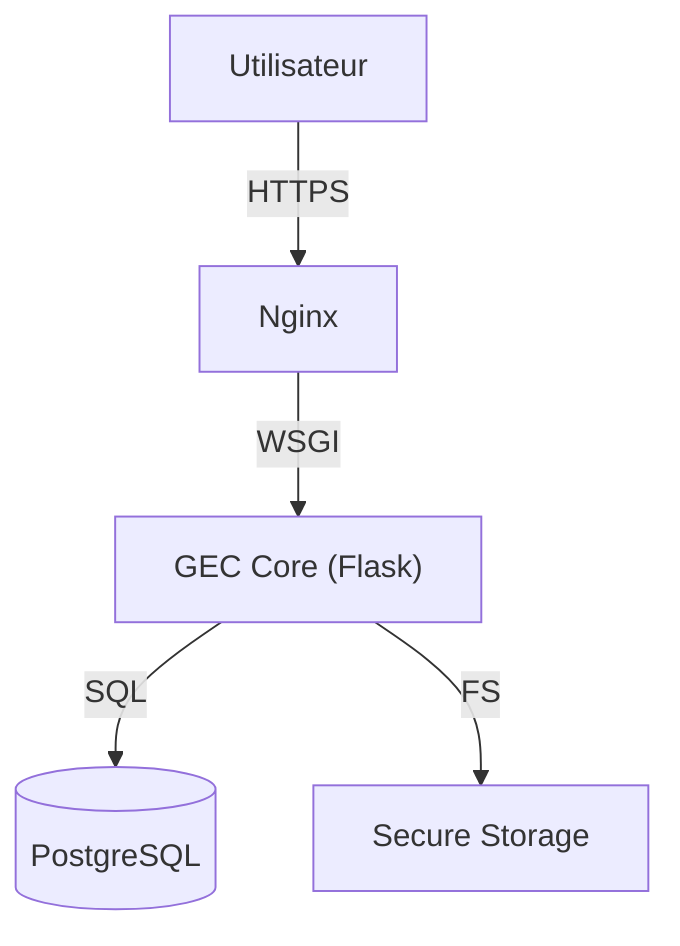

     

[ 🇫🇷 Français ](README.md) | [ 🇬🇧 English ](README_en.md)

# GEC - Gestion Électronique du Courrier

> **LOGICIEL PROPRIÉTAIRE - USAGE INTERNE STRICT.**
> Toute copie, distribution ou modification non autorisée est interdite.
> Copyright © 2024 MOA Digital Agency.

## 📌 Présentation
GEC est une solution de classe "Enterprise" pour la dématérialisation et la gestion sécurisée des flux de courriers (Entrants/Sortants). Conçue pour répondre aux exigences de haute sécurité (Chiffrement AES-256) et de traçabilité (Audit Logs) des administrations.

## 🏗 Architecture Globale



## 📑 Documentation

Toute la documentation technique et fonctionnelle se trouve dans le dossier `docs/`.

| Document | Description |
|----------|-------------|
| [**📖 La Bible des Fonctionnalités**](docs/GEC_Features_List.md) | Liste exhaustive de toutes les fonctionnalités. |
| [**🏗 Architecture Technique**](docs/GEC_Architecture_Technique.md) | Stack, flux de données et sécurité. |
| [**🪟 Déploiement Windows Server**](docs/GEC_Deploiement_Windows_Server.md) | Installation en une commande sur Windows Server 2016, 2019 et 2022. |
| [**🐧 Déploiement Linux**](docs/GEC_Installation_Deploiement.md) | VPS avec nginx, gunicorn et PM2. |
| [**⚖️ Licence**](LICENSE) | Termes d'utilisation et propriété. |

## 🚀 Installation

### Windows Server (2016, 2019, 2022)

**Installation rapide** : copier le dossier GEC sur le serveur, puis **double-cliquer sur
`INSTALLER-GEC.cmd`**. Python, PostgreSQL et les mots de passe sont installés et générés
automatiquement ; les identifiants sont écrits dans `IDENTIFIANTS-GEC.txt`.

Installation manuelle (Python 3.12 et PostgreSQL déjà installés), dans PowerShell
**en administrateur**, depuis le dossier de GEC :

```powershell
powershell -ExecutionPolicy Bypass -File deploy\windows\installer-gec.ps1
```

Procédure complète, modes Intranet / IIS et dépannage :
**[docs/GEC_Deploiement_Windows_Server.md](docs/GEC_Deploiement_Windows_Server.md)**.

### Linux (VPS)

Procédure complète : **[docs/GEC_Installation_Deploiement.md](docs/GEC_Installation_Deploiement.md)**.

### Poste de développement (Linux / macOS)

```bash
git clone https://github.com/moa-digitalagency/gec.git
cd gec
python3 -m venv .venv
.venv/bin/python -m pip install -r requirements.txt
cp .env.example .env        # renseigner GEC_MASTER_KEY et DATABASE_URL
.venv/bin/python main.py
```

## 📞 Contact
Pour toute question technique ou juridique : **MOA Digital Agency** (myoneart.com).
