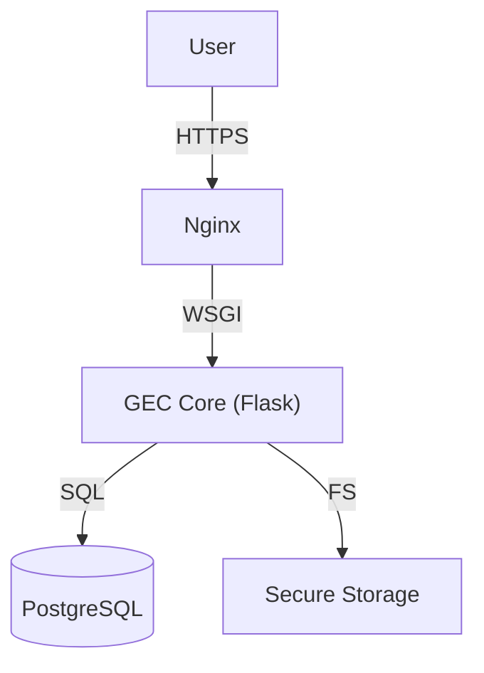

     

[ 🇫🇷 Français ](README.md) | [ 🇬🇧 English ](README_en.md)

# GEC - Electronic Mail Management

> **PROPRIETARY SOFTWARE - STRICTLY INTERNAL USE.**
> Any unauthorized copying, distribution, or modification is prohibited.
> Copyright © 2024 MOA Digital Agency.

## 📌 Overview
GEC is an "Enterprise" class solution for the dematerialization and secure management of mail flows (Incoming/Outgoing). Designed to meet high security requirements (AES-256 Encryption) and traceability (Audit Logs) for administrations.

## 🏗 Global Architecture



## 📑 Documentation

All technical and functional documentation can be found in the `docs/` folder.

| Document | Description |
|----------|-------------|
| [**📖 The Features Bible**](docs/GEC_features_full_list_en.md) | Exhaustive list of all features. |
| [**🏗 Technical Architecture**](docs/GEC_technical_architecture_en.md) | Stack, data flows, and security. |
| [**⚖️ License**](LICENSE_en) | Terms of use and ownership. |

## 🚀 Quick Install

```bash
# 1. Clone (Restricted Access)
git clone https://github.com/moa-digitalagency/gec.git

# 2. Environment
# Create a virtual environment (venv)
source .venv/bin/activate
pip install -r requirements.txt

# 3. Configuration
cp .env.example .env
# Configure GEC_MASTER_KEY and DB_URL

# 4. Run
python main.py
```

## 📞 Contact
For any technical or legal questions: **MOA Digital Agency** (myoneart.com).
