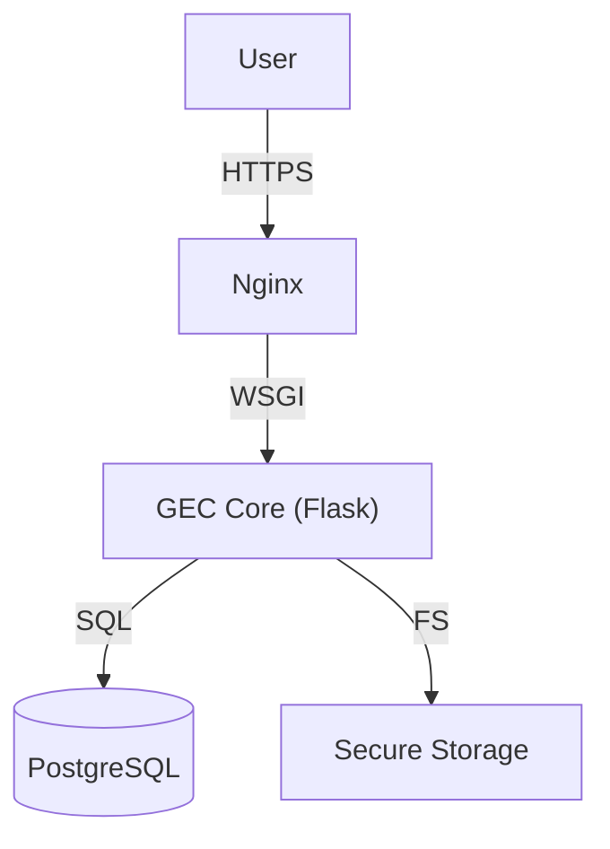

     

[ 🇫🇷 Français ](README.md) | [ 🇬🇧 English ](README_en.md)

# GEC - Electronic Mail Management

> **PROPRIETARY SOFTWARE - STRICTLY INTERNAL USE.**
> Any unauthorized copying, distribution, or modification is prohibited.
> Copyright © 2024 MOA Digital Agency.

## 📌 Overview
GEC is an "Enterprise" class solution for the dematerialization and secure management of mail flows (Incoming/Outgoing). Designed to meet high security requirements (AES-256 Encryption) and traceability (Audit Logs) for administrations.

## 🏗 Global Architecture



## 📑 Documentation

All technical and functional documentation can be found in the `docs/` folder.

| Document | Description |
|----------|-------------|
| [**📖 The Features Bible**](docs/en/GEC_Features_List.md) | Exhaustive list of all features. |
| [**🏗 Technical Architecture**](docs/en/GEC_Architecture_Technique.md) | Stack, data flows, and security. |
| [**🪟 Windows Server deployment**](docs/GEC_Deploiement_Windows_Server.md) | One-command install on Windows Server 2016, 2019 and 2022 (in French). |
| [**🐧 Linux deployment**](docs/GEC_Installation_Deploiement.md) | VPS with nginx, gunicorn and PM2 (in French). |
| [**⚖️ License**](LICENSE_en) | Terms of use and ownership. |

## 🚀 Installation

### Windows Server (2016, 2019, 2022)

**Quick install**: copy the GEC folder to the server, then **double-click
`INSTALLER-GEC.cmd`**. Python, PostgreSQL and all passwords are installed and generated
automatically; credentials are written to `IDENTIFIANTS-GEC.txt`.

Manual install (Python 3.12 and PostgreSQL already installed), in PowerShell
**run as administrator**, from the GEC folder:

```powershell
powershell -ExecutionPolicy Bypass -File deploy\windows\installer-gec.ps1
```

Full procedure, Intranet / IIS modes and troubleshooting (in French):
**[docs/GEC_Deploiement_Windows_Server.md](docs/GEC_Deploiement_Windows_Server.md)**.

### Linux (VPS)

Full procedure (in French): **[docs/GEC_Installation_Deploiement.md](docs/GEC_Installation_Deploiement.md)**.

### Development machine (Linux / macOS)

```bash
git clone https://github.com/moa-digitalagency/gec.git
cd gec
python3 -m venv .venv
.venv/bin/python -m pip install -r requirements.txt
cp .env.example .env        # set GEC_MASTER_KEY and DATABASE_URL
.venv/bin/python main.py
```

## 📞 Contact
For any technical or legal questions: **MOA Digital Agency** (myoneart.com).
